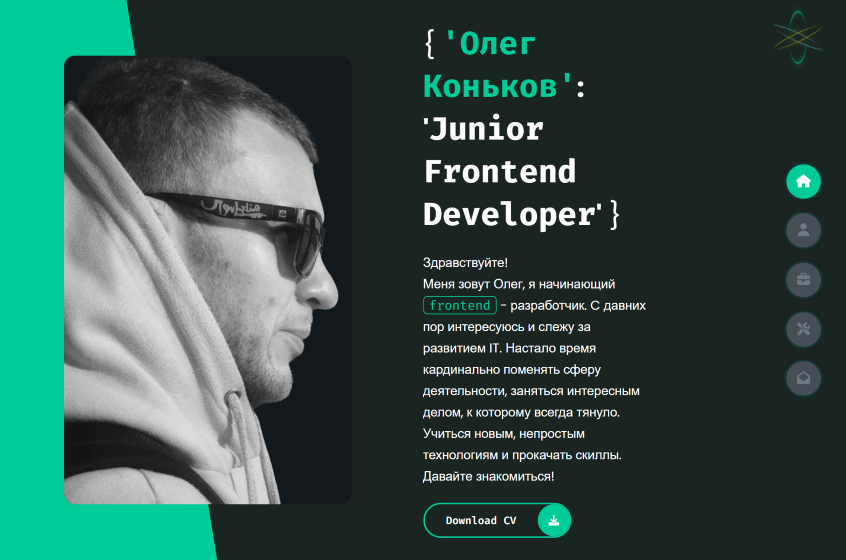

<h1 align="center">My Portfolio/Resume Project</h1>

#### What has been implemented:

- responsive design for mobile/tablet devices
- stlyle preprocessing: SCSS
- **`noscript`** tag activates when javascript is disabled on your browser and display the message
- switch dark/light theme cklicking button with animation
- using javascript function class **`activ`** is added to the element **`section`**, which allows to show the selected block
- using javascript **`active-btn`** class is added to the control buttons of the navigation panel as well
- a feedback form has been added to the contact section, each field must be completed before submitting
- a message is displayed when the form is submitted successfully
- a description of the buttons appears, by using js fuction when hovering over navigation bar control buttons
- click here => [_**Portfolio Website**_](https://bakna2t.github.io/fdcv/)

---

    

        
    

<!--  -->
